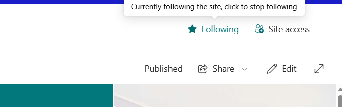
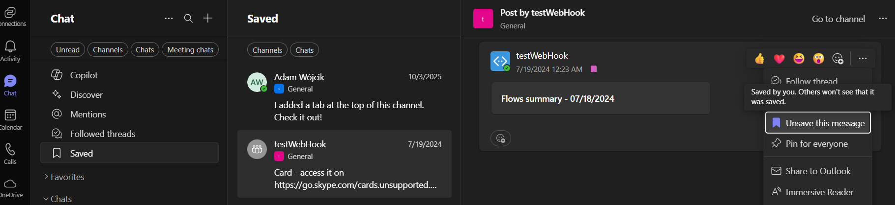
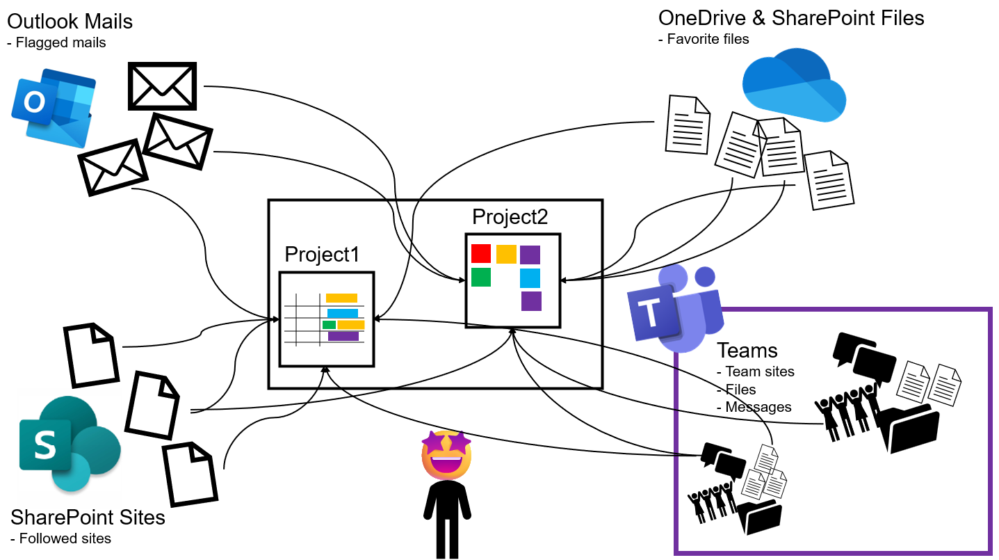
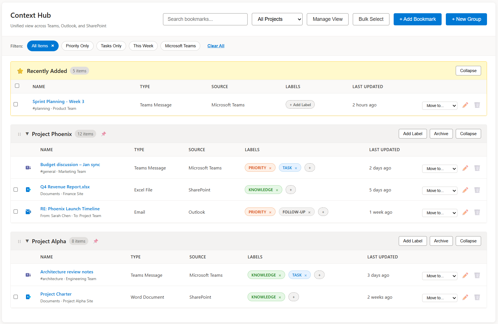

# Bookmark Hub

## 💡 Idea overview 

Microsoft Teams is our 'single point' platform that allows to organize all of our work in a structured and unified, easy to search way. At least this is what it was supposed to do. 🤔 To some extend this is correct as Microsoft Teams allows us to organize our work and projects into Teams. 

Each Team groups together: 

- conversations by organizing them in channels, 💬 
- emails by having group email boxes, 📧 
- SharePoint activities and files by having a team site correlated with each team 📁

This works perfectly for most of the use case but as we all now, life is never that simple, and there are always some lose ends we need to remember about and 'manually' correlate them with our work and projects. I'm thinking about: 

- those shared files we need to remember about 📎
- or just files stored outside of our Teams team, kept on our OneDrive or some different SharePoint site ☁️
- Those other SharePoint sites totally not connected in any way with our project 🌐
- Those important emails we need to remember that related to our work or project ✉️

All those lose ends we need to remember about and we start: 

- flagging emails, 

- following sites, 

- bookmarking messages, 

- and adding files to favorite

...  All this so we don't forget 🚩 

The problem is that it is still not organized. It is just 'saved for later not to forget'. Thats when CHAOS enters our work and projects. 🌪️

What if we could correlate all those 'saved for later' followed sites, favorite files, bookmarked messages, flagged emails... and organize them with tags and groups so it all has some meaning. ✨ 

## 🎯 Aim

The aim is to create a solution that will allow to easily find and organize all flagged emails, bookmarked team messages, favorite files and followed sites in a simple table or tile views. 📊 The solution should allow to dynamically add custom columns allowing to add additional context to each item: file, site, mail, message, other. 📝 A good example is allowing to add a priority column, due date, labels (similar like GitHub labels) or tags. 🏷️ The views should also allow to dynamically group items and order them based on those labels, tags or other custom column values. This should allow to easily correlate items together into groups that will represent projects, unit of work, or tasks. 📋

The application should easily be exposed as a full page SharePoint application, Microsoft 365 app, and a Teams personal app. 🚀 

Optionally the application could allow to:

- add any kind of custom item, like a note or a url to external resources, to the table so that it may be correlated with rest of the items 🔗
- add additional resources from Microsoft 365 like Planner plans, Team teams or dedicated channels, Viva Engage groups 📅
- add an AI feature that would allow to dynamically group items together and.... I don't know... the other stuff AI is good at like: summarize items, expose sensitive user tokens etc. 🤖

## 🖼️ Inspiration drawing

Below is an AI generated app that we may use as inspiration what we aim

